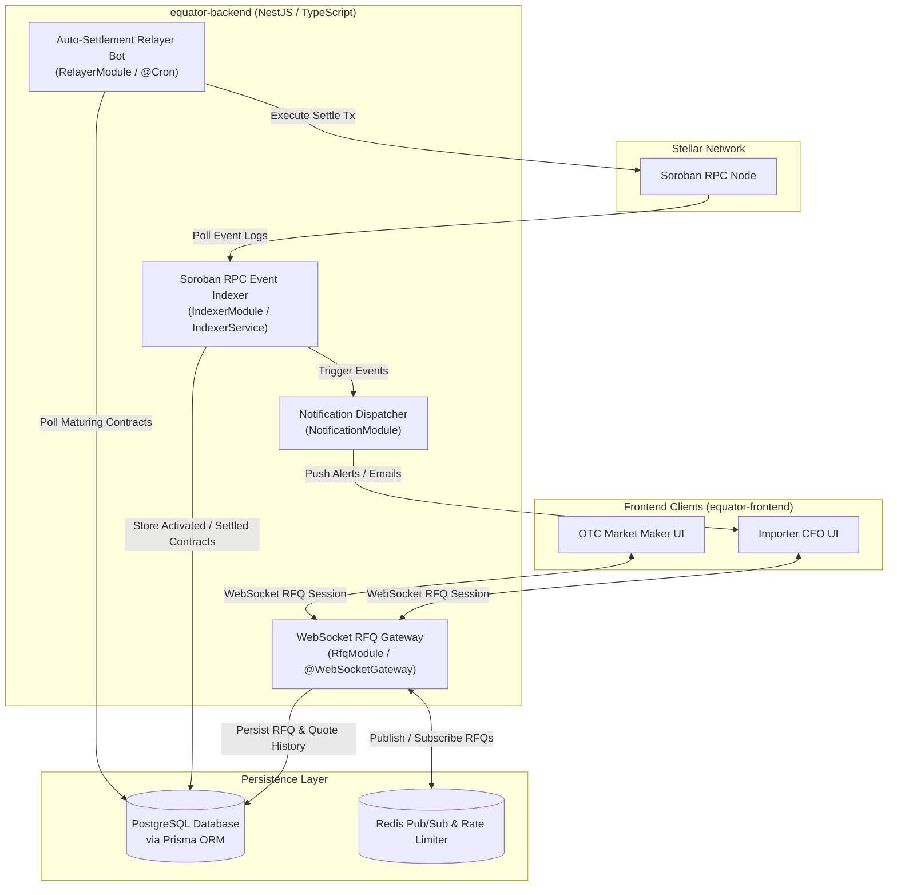

# Equator Finance: Off-Chain Engine & Indexer (`equator-backend`)

> **What is Equator Finance?**  
> Equator Finance is a decentralized B2B FX Forward Protocol built on Stellar (Soroban) for emerging markets. It allows corporate importers and OTC liquidity desks to trustlessly lock in future exchange rates using USDC-settled Non-Deliverable Forwards (NDFs), while routing idle collateral into decentralized yield venues to significantly offset hedging costs.
>
> **Role of this repository:** This repository houses the off-chain middleware, WebSocket RFQ matching engine, Soroban event indexer, and real-time notification services that power the protocol's user experience.

📖 **Central Protocol Overview:** For the master architecture, protocol vision, and multi-repo roadmap, see the [Equator Finance Master Readme](https://github.com/Equator-Finance/.github).

---

## 🎯 Repository Scope & Overview

`equator-backend` powers the high-performance middleware facilitating off-chain negotiations between importers and market makers, indexing on-chain Soroban events, and managing real-time notifications.

### Tech Stack:
* **Framework:** **NestJS** (TypeScript)
* **Runtime:** Node.js 20+
* **Real-time Protocol:** WebSockets (`@nestjs/websockets` / Socket.io / `ws`)
* **Database & ORM:** PostgreSQL 15 managed via **Prisma ORM**
* **Cache & Message Broker:** Redis 7 (Pub/Sub & BullMQ for job queues)
* **Blockchain Client:** `@stellar/stellar-sdk` (Soroban RPC client)

---

## 🏗 Repository-Specific Backend Architecture

The backend operates as an event-driven NestJS system coordinating off-chain order matching with on-chain Soroban events.



---

## 🛠 Project Structure (Target)

```text
equator-backend/
├── src/
│   ├── rfq/             # RfqModule: WebSocket gateway for RFQ order matching
│   ├── indexer/         # IndexerModule: Soroban RPC event listener & DB sync
│   ├── relayer/         # RelayerModule: Cron bot executing maturity settlements
│   ├── notifications/   # NotificationModule: Push/Email notification dispatcher
│   └── kyc/             # KycModule: Institutional onboarding & Sumsub integration
├── prisma/              # Prisma database schema & migrations
├── docker-compose.yml   # Local environment setup (NestJS API, Postgres, Redis)
├── Dockerfile           # Multi-stage production container build
└── README.md
```

---

## 🚀 Development Phases

### Phase 1: RFQ Matching Engine & Soroban Event Indexer
* **Goal:** Enable off-chain quote negotiation and track active Soroban contract states in real time.
* **Key Tasks & Deliverables:**
  * **WebSocket RFQ Server:** Build bi-directional NestJS WebSocket Gateway for importers to broadcast RFQs and OTC desks to respond with rates.
  * **Soroban Event Listener:** Poll and index Soroban RPC logs to monitor `ForwardCreated`, `MarginLocked`, and `Settled` events.
  * **Database Layer:** Implement PostgreSQL database schema to store historical quotes, contract states, and user profiles.

### Phase 2: Real-time Alerting & Oracle Heartbeat Monitor
* **Goal:** Keep CFOs and desks informed of critical contract milestones and market volatility.
* **Key Tasks & Deliverables:**
  * **Notification Pipeline:** Dispatch automated alerts (Email via SendGrid, Push/Telegram) for:
    * RFQ acceptance
    * 24-hour maturity warnings
    * Settlement completions
  * **Oracle Discrepancy Monitor:** Track off-chain FX feeds against on-chain oracle reports to detect anomalies or stale prices early.

### Phase 3: Compliance Gateway & Automated Relaying
* **Goal:** Streamline institutional onboarding and provide zero-click transaction execution.
* **Key Tasks & Deliverables:**
  * **KYC/AML Gateway:** Middleware integrating Sumsub/Persona for corporate entity verification before trading access is granted.
  * **Auto-Settlement Relayer:** Automated NestJS Cron bot that triggers the `settle_at_maturity()` function on Soroban as soon as the maturity block height is reached.
